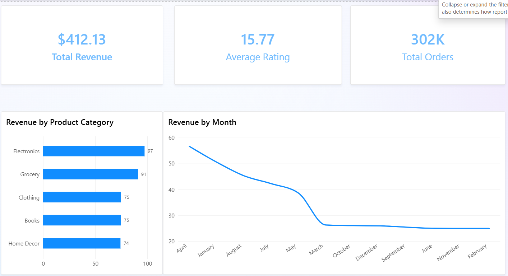
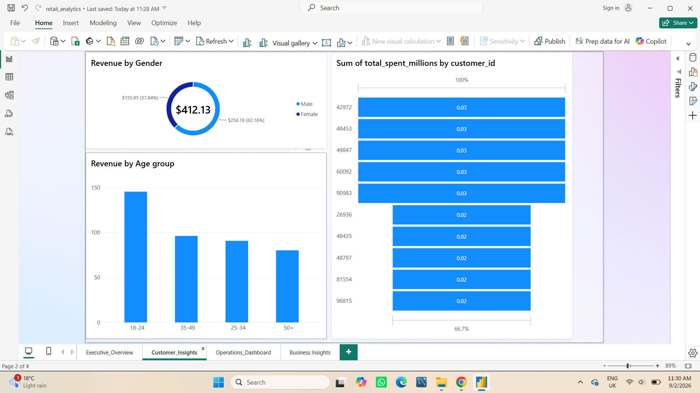
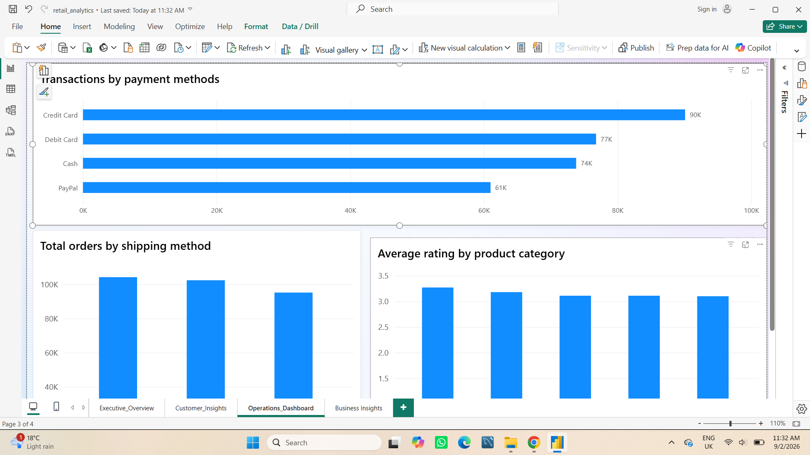

# E-Commerce Sales Analytics Dashboard

A sales analysis project using **SQL, Excel and Power BI** to understand revenue, customer behaviour and order performance.

The aim was to answer practical business questions: what is driving revenue, who the main customers are, and where performance could be improved.

## Dashboard

### Executive Overview

### Customer Insights

### Operations Dashboard

## Tools

* **SQL (BigQuery)** — querying and analysing the data
* **Excel** — cleaning and checking the data
* **Power BI** — dashboard and reporting

## What I Analysed

I looked at:

* Revenue by product category
* Monthly sales performance
* Customer age and gender
* Top customers by spending
* Payment methods
* Shipping preferences
* Product ratings

## Key Findings

**Electronics was the strongest product category**, generating the highest revenue. Home Decor generated the lowest revenue.

**April was the strongest month for sales**, showing that revenue was not evenly distributed throughout the year.

**Customers aged 18–24 were the highest-spending age group**, while customers aged 50+ contributed the least revenue.

**Male customers generated around 63% of total revenue**, showing a noticeable difference in revenue by gender.

**Credit card was the most commonly used payment method**, while PayPal had relatively low usage.

**Same-day delivery was the most popular shipping option**, suggesting customers value faster delivery.

Electronics also received the **highest average customer ratings**, so the category performed strongly in both revenue and customer feedback.

## Business Takeaways

The analysis suggests that Electronics should remain an important category for the business, while lower-performing categories such as Home Decor may need further investigation.

The strong contribution from younger customers could also be useful when planning promotions and customer targeting.

Since same-day delivery was the most popular shipping option, delivery speed appears to be an important part of the customer experience.

## Repository

* `sql/` — SQL analysis
* `excel/` — Excel analysis and supporting data
* `power bi/` — Power BI dashboard
* `screenshots/` — dashboard screenshots

## About the Project

This is a portfolio project created to practise the type of sales and customer analysis carried out by data analysts. The focus was not only on building a dashboard, but on using the data to answer business questions and explain what the results mean.

